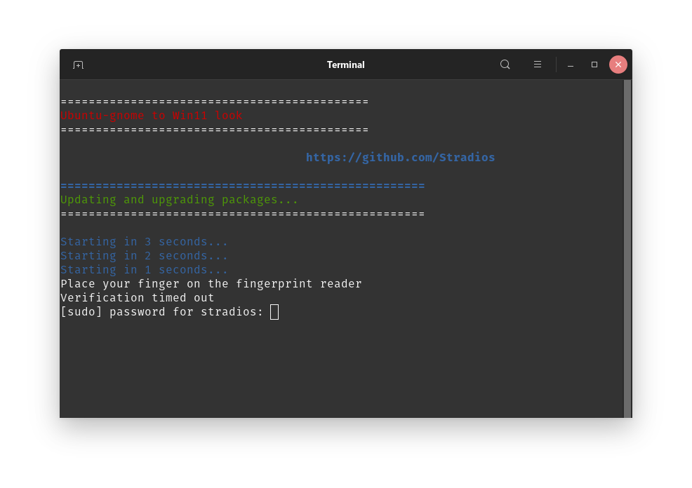

# UB_to_Win

    

    sudo apt install git
    cd Downloads/
    git clone https://github.com/Stradios/UB_to_Win.git
    cd UB_to_Win/
    chmod +x install-me.sh
    ./install-me.sh

* Update and upgrade packages
* Install Ubuntu restricted extras
*  <a href="https://github.com/vinceliuice/Fluent-gtk-theme">Fluent GTK theme installation script</a>
* <a href="https://github.com/yeyushengfan258/Win11-icon-theme">FWin11-icon-theme installation script</a>
* <a href="https://github.com/mrbvrz/segoe-ui-linux">Run Segoe UI Linux installation script</a> From https://github.com/mrbvrz
* Install Extension Manager via Flatpak 

